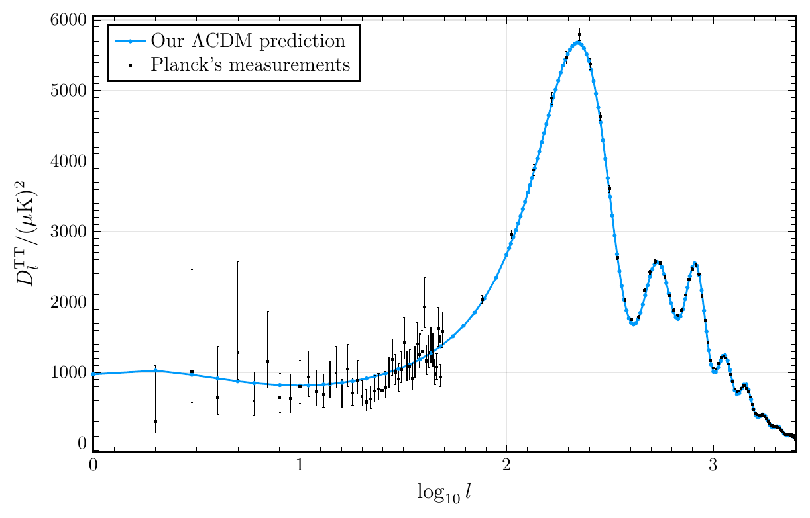
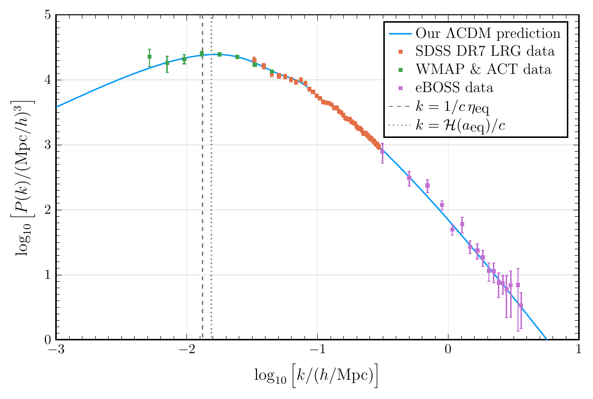

COMBO.jl: an Einstein-Boltzmann solver
==========================================

**COMBO** is a **CO**smic **M**icrowave **B**ackground (and matter) power spectrum **O**btainer.





Instructions
------------

[Download and install Julia](https://julialang.org/downloads/), add `julia` to your `$PATH`, then
```
git clone https://github.com/hersle/COMBO.jl
cd COMBO.jl/
julia --project=. -e 'using Pkg; Pkg.instantiate(); Pkg.resolve(); Pkg.precompile()' # install, resolve and precompile dependencies
julia --project=. Milestone1.jl # produce output for background cosmology
julia --project=. Milestone2.jl # produce output for recombination and reionization history
julia --project=. Milestone3.jl # produce output for perturbations
julia --project=. Milestone4.jl # produce output for matter and CMB power spectra
julia --project=. MilestoneA.jl # produce output for supernova parameter fits
julia --project=. MilestoneB.jl # benchmark each component of the program
```

Julia is a precompiled language,
so dependency installation, precompilation and the first run can take long!

For the plots to look as intended, PGFPlots must be installed.
Otherwise, a different plotting backend is used,
and the plots may not look as nice.
